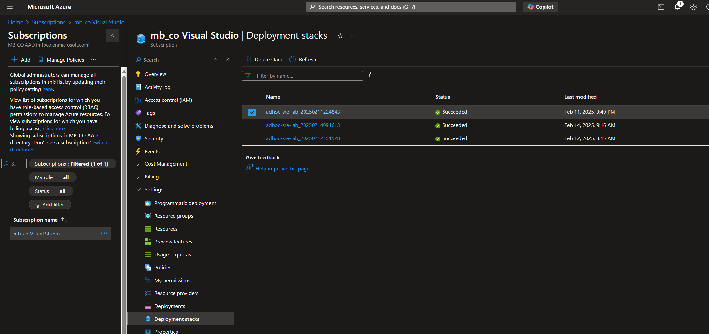

# Instructor Guide for Lab

This is a simple sample lab to demonstrate the framework. Students run an a lab deployment, then are required to complete additional steps to make the lab functional. Then, they clean up the lab.

## Student Lab Deployment Details

The lab deployment takes a couple minutes. To monitor the lab deployment, the student should see a new Resource Group for the lab content, as well as a Deployment Stack resource at the subscription level.

### Troubleshooting Student Resource Deployment

- If the student receives an error that they do not have the required permissions, ensure they are using a subscription where they are owner.
- If there are issue related to checking quotas (installing modules, registering the Quota resource provider, etc, but not that there is insufficient quota), have the student try deploying the lab with the `-skipQuotaCheck` parameter to bypass the check--if quota is sufficient, the deployment will complete; otherwise, it will fail with a quota error.

## Shared Resource Deployment Details

There are no shared resources.

### Troubleshooting Shared Resource Deployment

## Lab Delivery

See student guide.

## Lab Cleanup

Instruct students to use the cleanup script as detailed in the student guide. Alternatively, the Deployment Stack can be deleted by removing it in the Portal.

